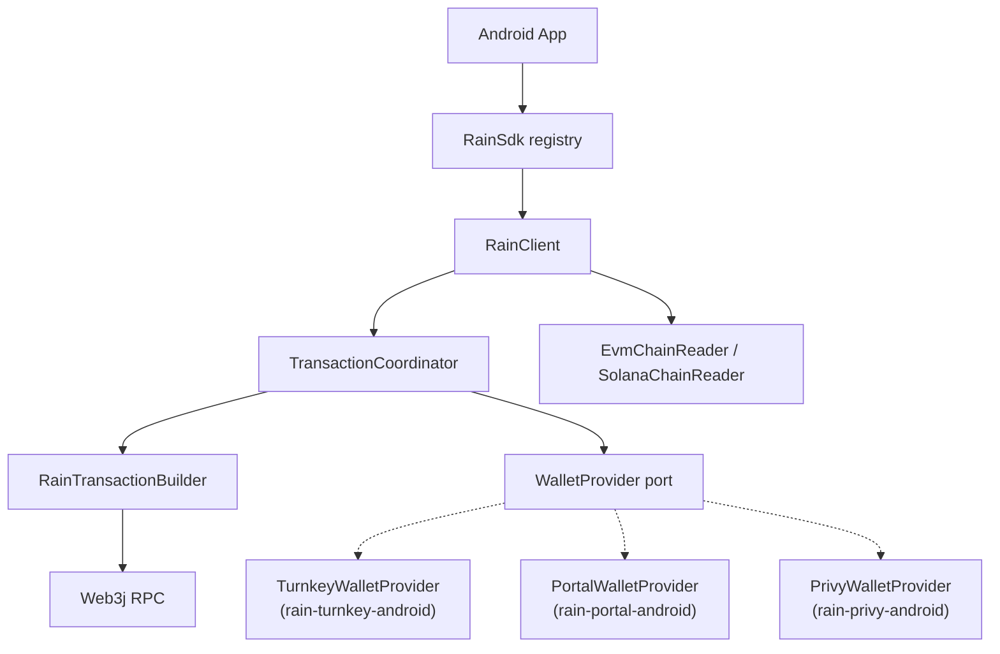

# rain-core-android

The vendor-free core of the modular Rain Android SDK — the "one core" in *one core, many providers*.

Contains:

- The **`WalletProvider`** port (the capability the SDK needs from any wallet).
- The **`RainProvider`** descriptor + **`RainSdk`** builder/registry
  (`RainSdk.builder().register(…).build()`, resolve via `provider(id)` / `first { }`).
- The **`Capability`** model and **`ProviderId`**.
- All Rain domain logic — EIP-712 message building, collateral withdraw flow (EVM and Solana),
  transaction orchestration, chain readers, token metadata store.
- The cross-module seams the adapter modules build on, marked `@RainAdapterApi`: the chain
  readers, the JSON-RPC client, the Solana encoders, and the token metadata store. Marked rather
  than plain public so they stay out of the contract with host apps.

`rain-core-android` has **no wallet-vendor dependency at all**. Every vendor SDK lives in its own
adapter module, so a Portal-only app never fetches Turnkey and a Turnkey-only app never fetches
Portal.

Add a wallet provider by depending on its adapter, which pulls core transitively:
`:rain-turnkey-android`, `:rain-portal-android` or `:rain-privy-android`.

```kotlin
// Bring-your-own Turnkey, from :rain-turnkey-android — the host authenticated turnkeyContext.
val rain = RainSdk.builder()
    .rpcEndpoints(mapOf(8453 to "https://mainnet.base.org"))
    .register(TurnkeyProvider(TurnkeyConfig(turnkey = turnkeyContext)))
    .build()

val client = rain.provider(ProviderId.TURNKEY)
val address = client.getWalletAddress()
```

## Architecture



A provider is registered on the builder and resolved into a `RainClient` bound to that one wallet.
Core imports no wallet vendor; every adapter lives behind the port in its own module.

## Entry points

- **`RainSdk`** — the registry plus the wallet-agnostic surface: `provider(id)` / `first { }`,
  the transaction-building methods, and the Rain issuing API (`configureRainApi`, `fetchCollateralContracts`,
  `fetchCollateralContract`, `fetchAdminSignature`).
- **`RainClient`** — everything bound to one resolved wallet: addresses and QR, balances, transfers,
  `withdrawCollateral`, fee/gas estimation, history, `registerTokens`.
- **`RainTransactionBuilder`** — for hosts signing with their own wallet: `getLatestNonce`,
  `isCollateralAdmin`, `buildEIP712Message`, `buildWithdrawTransactionData`. Reached via
  `RainSdk` directly, so it needs no resolved provider.

Full parameter tables live in [docs/METHODS.md](../docs/METHODS.md).

## Error handling

Every SDK operation throws a `RainError` subclass carrying a stable `RAIN_*` code. The code table is
a cross-platform contract, pinned by `RainErrorCodeParityTest` — see
[docs/METHODS.md](../docs/METHODS.md#errors) for the full list.

## Configuration

RPC endpoints are supplied on the builder, once, for every chain the app uses. `RainChain` holds the
chain-ID constants, including the Solana sentinels (`SOLANA_MAINNET` 900, `SOLANA_DEVNET` 901,
`SOLANA_TESTNET` 902) the SDK uses to route Solana work.

```kotlin
RainSdk.builder()
    .rpcEndpoints(
        mapOf(
            RainChain.BASE_SEPOLIA to "https://sepolia.base.org",
            RainChain.SOLANA_DEVNET to "https://api.devnet.solana.com"
        )
    )
```

`registerTokens(...)` names tokens the SDK cannot discover on chain — an SPL mint carries no
on-chain symbol, and the built-in registry covers mainnet only. Available on the builder and on a
resolved `RainClient`.
